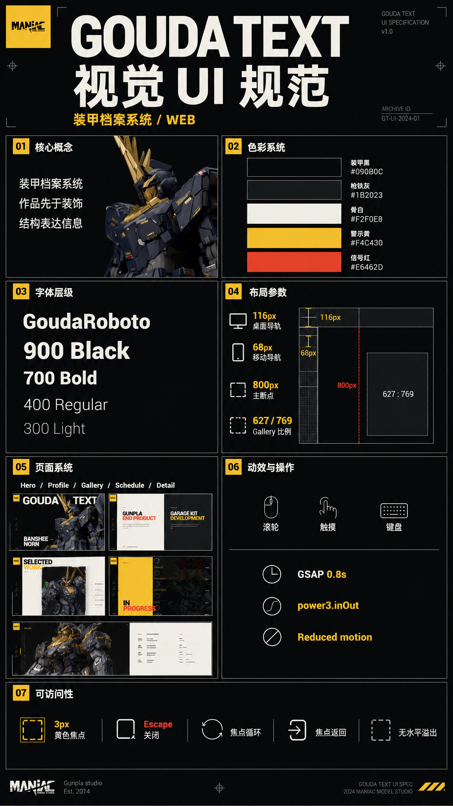

# GoudaText 视觉 UI 说明

> 版本：1.0  
> 适用范围：GoudaText Gunpla Showcase  
> 实现依据：`src/App.vue`、`src/styles.css`、`src/data/products.js`

图片版用于快速评审与分享；本文件中的文字规范和代码参数是实现时的权威依据。

## 1. 视觉定位

GoudaText 的界面被定义为一套“装甲档案系统”。它不是常规的摄影作品集，也不是泛化的未来科技界面，而是一张用于查看完成品、制作信息和项目进度的模型检视台。

设计的核心任务是让模型作品成为第一视觉信号，同时用具有工程感的结构帮助用户定位、选择和深入浏览作品。大胆感集中在巨幅字形、机体裁切和黑黄对比上，其余元素保持克制。

## 2. 核心原则

1. **作品先于装饰**：首屏和 Gallery 使用真实模型素材作为主视觉，不增加无意义的背景效果。
2. **结构表达信息**：边框、序号、分栏和索引用于定位内容，不作为纯装饰。
3. **高对比但有节制**：黄色只表示当前状态、核心动作和重点信息；红色用于次级强调和状态切换。
4. **同一数据直接驱动界面**：Gallery、详情标题、计数和图片集都直接使用 `products`，不建立同义字段或镜像模型。
5. **移动端重新编排**：移动端不是桌面界面的缩小版，而是将侧栏、作品索引和内容列转换为适合触控的纵向结构。

## 3. 色彩系统

| Token | 色值 | 角色 | 使用范围 |
| --- | --- | --- | --- |
| Armor Black | `#090B0C` | 主背景、深色画布 | Hero、导航、详情页 |
| Gunmetal | `#1B2023` | 次级深色表面 | Profile 深色半区、图片占位 |
| Bone White | `#F2F0E8` | 主文字、浅色画布 | Gallery、Profile 浅色半区 |
| Warning Yellow | `#F4C430` | 主强调与当前状态 | CTA、活动导航、详情工具栏 |
| Signal Red | `#E6462D` | 次强调与切换状态 | 标题强调、元信息、移动端选中项 |

### 色彩使用约束

- 黄色不用于大面积背景之外的重复装饰；单个页面只保留一个主黄色视觉区域。
- 红色不能与黄色竞争主操作优先级。
- 浅色表面使用 Armor Black 文本，深色表面使用 Bone White 文本。
- 次级文字从当前前景色降低透明度生成，不额外引入中性灰色 Token。

## 4. 字体与层级

界面只使用项目内置的 `GoudaRoboto` 字体族，避免网络字体导致布局跳动。

| 层级 | 字重 | 用途 |
| --- | --- | --- |
| Display | 900 / Black | 品牌字标、页面主标题、作品名称 |
| Strong | 700 / Bold | CTA、索引当前项、编号、元信息 |
| Body | 400 / Regular | 正文和说明文字 |
| Quiet | 300 / Light | 低优先级说明 |

标题使用紧凑行高和最多 `-0.035em` 字距。正文控制在约 `46ch`，使用较宽松行高。数字计数采用等宽数字特性，避免切换时产生跳动。

## 5. 页面骨架

### 全局导航

- 桌面端为左侧 `116px` 固定导轨。
- 移动端在 `800px` 断点以下转为顶部 `68px` 导航条。
- 当前页面以黄色标记，非当前项保持低对比。
- Logo 按钮始终返回 Hero。

### Hero

- `GOUDA TEXT` 是第一视口的品牌信号。
- Banshee Norn 透明素材全屏铺陈，并与字标形成前后层次。
- 作品名称、规格、查看动作和当前序号组成底部识别区。
- 页面载入只对 Hero 信息执行一次入场动画。

### Profile

- 使用 Bone White 与 Gunmetal 的左右对照，分别承载成品制作和 Garage Kit 开发。
- 大标题是主要层级，说明文字保持窄列。
- 联系方式位于浅色区域底部，品牌 Logo 位于深色区域底部。
- 移动端改为上下排列，联系方式成为独立黄色信息带。

### Gallery

- 当前作品大图位于视觉中心，是页面唯一主焦点。
- 桌面端右侧显示六项作品索引，移动端压缩为六格数字选择器。
- `Previous` 与 `Next` 只改变 `activeProductIndex`。
- 点击当前作品打开完整详情，不复制产品数据。

### Schedule

- 左侧黄色区域承载页面标题，右侧五条真实项目图片展示进度内容。
- 深色遮罩保证文字可读；悬停时降低遮罩，让作品图像显现。
- 移动端改为上方标题区与下方纵向列表。

### Detail

- 详情为受保护焦点的全屏查看层。
- 黄色工具栏提供关闭动作与稳定的两位数计数。
- 桌面端使用双列图片流，移动端转换为单列。
- 计数按产品稳定 `id` 定位，避免响应式代理对象导致引用比较失效。

## 6. 交互与动效

- 页面支持滚轮、单指纵向滑动、方向键和 Page Up / Page Down。
- 章节切换使用 GSAP，时长 `0.8s`，缓动为 `power3.inOut`。
- 动画期间锁定新的章节请求，避免时间线互相覆盖。
- Gallery 图片悬停仅执行轻微放大，动作反馈保持短促。
- 详情打开后焦点进入 Close；Tab 在弹层内部循环；Escape 关闭后焦点返回原触发元素。
- `prefers-reduced-motion: reduce` 下将动画与过渡降至近乎即时。

## 7. 响应式规则

| 区间 | 核心变化 |
| --- | --- |
| `> 1000px` | 完整左侧导轨、三列 Gallery、双列详情图片 |
| `801px - 1000px` | 收紧 Gallery 列宽与 Profile 内边距 |
| `<= 800px` | 顶部导航、页面纵向重排、Gallery 数字索引、单列详情 |
| `<= 420px` | 缩小 Logo 区和文字尺寸，Gallery 控制纵向堆叠 |

固定格式组件使用明确尺寸或比例：Gallery 主图采用 `627 / 769`，导航具有稳定高度，索引按钮具有稳定最小高度。所有页面在 `390 x 844` 视口下不得产生水平滚动。

## 8. 可访问性

- 键盘焦点使用 `3px` Warning Yellow 外框与 `4px` 偏移。
- 所有图像提供与作品名称一致的替代文本。
- 图像加载失败统一回退到 `/img/defualt.jpg`。
- 详情使用 `role="dialog"`、`aria-modal="true"` 和动态标签。
- 图像详情启用懒加载和异步解码。
- 文本选择状态使用黄色背景与黑色文字。
- 自定义滚动条沿用黄色与 Gunmetal 配色。

## 9. 素材规范

- Hero 优先使用具有透明通道的机体 PNG，以便模型轮廓与品牌字标产生真实遮挡。
- Gallery 封面保持竖向模型摄影，当前基准比例为 `627 / 769`。
- Schedule 使用 `1680 x 360` 的横向项目图。
- 详情图保持原始比例，不强制统一裁切。
- 禁止使用与模型无关的抽象光球、渐变光斑或装饰性插画。

## 10. 实现映射

| 规范内容 | 权威位置 |
| --- | --- |
| 产品名称、封面、详情图片 | `src/data/products.js` |
| 页面状态、切换、弹层行为 | `src/App.vue` |
| Token、排版、布局、断点 | `src/styles.css` |
| 页面主题色与基础元数据 | `index.html` |

## 11. 发布前检查

- 品牌与主作品是否在第一视口可见。
- 黄色是否只标记当前状态和主要动作。
- 六项 Gallery 索引是否与 `products` 顺序一致。
- 详情标题、图片和计数是否来自同一个选中产品。
- Escape、Tab、焦点恢复和减少动态模式是否有效。
- `390px`、`800px`、`1000px` 和桌面视口是否无横向溢出。
- 空值或图片失败时是否仍保留可操作界面。
